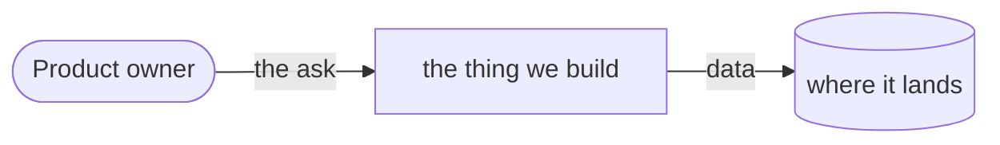

# Pitch — {{TITLE}}

Moves: <input key> · Tests: <dimension>
<!-- When `strategy.mjs` printed the project's strategy at Stage 0: name the input metric
     this seed moves and the PMF dimension it tests (or write "Moves · Tests: neither — <why>"). With no
     Roadmap/00-strategy/, write "Moves · Tests: not grounded — no strategy yet" (references/strategy.md). -->

## The ask, as given
<!-- The product owner's words, VERBATIM, as they arrived (Stage 1) — never tidied, never summarised. The intent
     score compares the pitch against this, so a rewrite here would score the pitch against itself. -->

> <paste the ask here, word for word>

### Claims
<!-- Stage 1: split the ask into the separate things it asks for, one per line, in the product owner's terms. The
     product owner may edit this list; the scorer only reads it. -->
1. <one thing the ask asks for>
2. <another>

**Teach-back:** <yes | partly | no> — "<the Stage 1 mirror: You want X so that Y. Right?>"
<!-- Record the product owner's answer to the mirror: yes, partly or no. Leave the placeholder if it was never asked;
     an unanswered teach-back is left out of the score, not counted as zero. -->

## Problem
<!-- The specific pain/story motivating this — narrowed at Stage 1, never a grab-bag. -->

## Appetite
<!-- S | M | L and what that buys (WAYS-OF-WORKING → Betting & appetite). This is the budget the
     problem is WORTH, fixed before the solution — not an estimate. The solution below must fit
     it; if it can't, reshape or cut, don't grow the appetite. -->
quote: <!-- the line `quote.mjs --appetite <A>` prints, e.g. $24–35 (M, n=4, p25–p75) — ≈ API $, never typed by hand;
     scaffold-epic copies it into the epic README -->

## Outcome & signal
<!-- What's true after this ships that isn't now? How will the product owner test it? -->

## Stage-2.5 bucket
<!-- already-possible | light-enhancement | genuinely-new — and why. -->

## Bill of materials (What / Why)
<!-- The solution's parts — as few words per cell as possible, rough on purpose. The product owner
     edits the Why column; a Why neither of you can defend is a part you cut. Lean on parts that
     already work (that's how tissue turns into bone) — reuse 3 primitives before adding 10. -->

| What | Why |
|---|---|
|  |  |

## Scope
**In v1:**
**Out of v1 (no-gos):**
<!-- No-gos are deliberate exclusions, stated so the appetite holds — what we are NOT doing. -->

## Rabbit holes
<!-- Patch holes in advance: the tricky design decisions made HERE, the technical unknowns vetted,
     the "this could eat the whole appetite" traps named so a builder doesn't fall in. -->

## What already exists (reuse, don't rebuild)
<!-- Concrete files / routes / primitives (the platform-first reframe — Stage 4: read the backend
     model/route first; this list is what repeatedly re-scopes epics smaller). -->

## Visuals
<!-- Stage 4.6 — drawn from the SHAPE of the ask, not from taste. Every shaped bet (appetite M or L) gets a system
     context: actors, systems and the data flow between them. Add whatever the ask's shape triggers (the table in
     the refine skill's references/intent-and-visuals.md): a flow, a state machine, a sequence or a container diagram in Mermaid; a data sample as a
     table of three real-looking rows; a screen as a `surface` block. Fixed-scope work (appetite S) draws only when a
     trigger fires. Delete the examples you don't use. -->



A screen, as a `surface` block — one block per state: its id, its route, then one line per block in order, by kind,
with the words that matter. End the id with the state's name from the ten: idle · hover · focus · pressed · loading ·
success · error · empty · disabled · unbuilt. Render it for review with
`node scripts/sketch-render.mjs <this seed> --out <file>.html`.

```surface
state: orders-empty
route: /orders
- head "Orders" action "Share your shop"
- empty "No orders yet. Your first sale shows up here."
```

## UX heuristics & rails check
<!-- Keep this a checklist, not an essay. -->
- **CI guards covering this surface:** <name the project's guards, or "none — say so">
- **Audits-lens findings that apply:** <cite the project's `00-ideas/audits/` findings, or "none found">
- **Design-language debt (if any):** <e.g. raw hex, missing shared component, inconsistent spacing>

## Kill-switch / runtime gate (risk:high only — Stage 6b)
<!-- Delete this block if risk:low. Default: NO flag unless the product owner asks for one. If one is
     asked for, record the decision per the refine skill's references/kill-switch.md — the ONE home of the
     flag/polarity/seam/activation/placement rule (never restate it here) — OR a one-line carve-out
     reason. The mechanism is Golden Frijoles; `node scripts/preflight.mjs` says whether this project can
     create one at all. -->

## Acceptance criteria
<!-- Plain-language checks per story. -->

## Open risks / research
<!-- Cite present-day facts where the ask leans on anything recent/changing. -->
